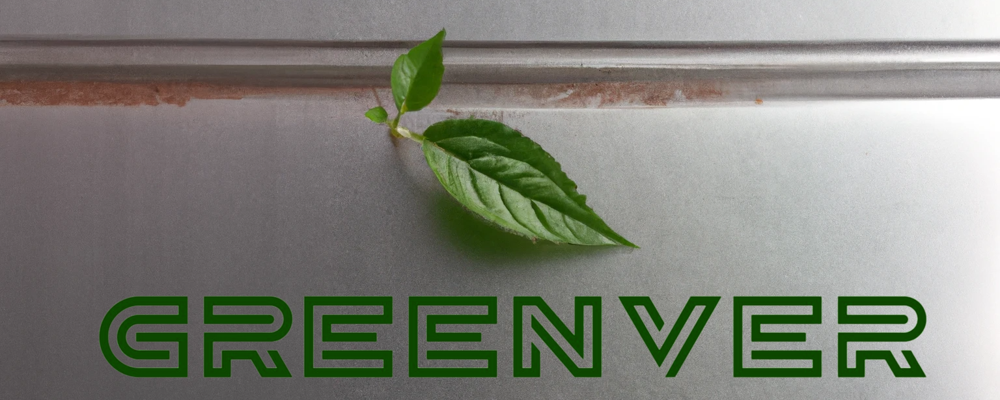

Cronvall challenge **Making industrial purchase decisions more transparent & sustainable**
JUNCTION 2022.
Project for Cronvall challenge at Junction hackathon '22

## App description
The app consists of backend and frontend parts. 
The frontend is a Chrome extension working on Cronvall website, the code for it can be found in the current repository. 
The backend is a simple Flask server using sentence_transformers and pandas for data analysis. 
The backend code is placed in junction22-backend repository (sub-module of this repo).

### How to start frontend
1. download the repo
2. go to [chrome://extensions/](chrome://extensions/), toggle Developer mode in top-right corner, press Load unpacked with the path to downloaded repo
3. go to https://www.cronvall.fi/ -> Metal and Plastic Sheets

### How to start backend
1. install requirements.txt
2. `flask run`

### Features
- Sustainability information for products ([example](https://www.cronvall.fi/epages/CronvallShop.sf/secb69bc55229/?ObjectPath=/Shops/CronvallShop/Products/2201151085&ViewAction=ViewProduct&SearchParams=%7B%22Materiaali%22%3A%22Kuumasinkitty+DX51D%2BZ275MAC%22%7D))
  - sustainability score, alternatives, emissions and other information for different materials (most data present for metal sheets)
- Recycling: on every product page there is an option to return some amount of product instead of buying new - this helps customers get rid of excess materials without producing any waste
  - can be seen on any product page or basket view
