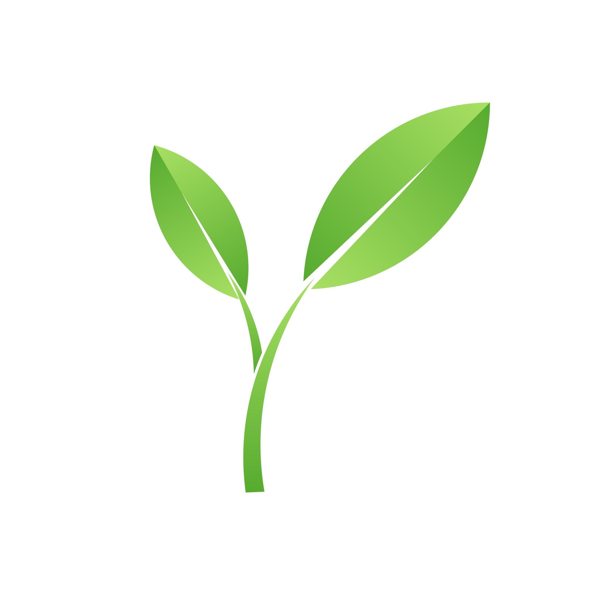

<b>MAKING INDUSTRIAL PURCHASE DECISIONS MORE TRANSPARENT & SUSTAINABLE</b>

<a href="https://www.cronvall.fi/">CRONVALL</a>, <a href=https://www.hackjunction.com/>JUNCTION'22</a>

## Project description
Let's help the customers make more sustainable and data-driven decisions.  
Grenver - clever assistant that collects and provides up-to-date information on the most sustainable products on the marketplace.

As part of the hackathon, Grenver provides guidance on how to find the most sustainable metal sheet for [Cronwall](https://www.cronvall.fi/) customers.  
Touch this [demo](https://www.cronvall.fi/epages/CronvallShop.sf/secb69bc55229/?ObjectPath=/Shops/CronvallShop/Products/2201151085&ViewAction=ViewProduct&SearchParams=%7B%22Materiaali%22%3A%22Kuumasinkitty+DX51D%2BZ275MAC%22%7D). 

### Features
- **Sustainability information for products**  
  - **Sustainability score** as a measure of Sustainability for a product. A metric calculated on: Energy Consumed in production
, Carbon Footprint and Water Usage.  Can be extended to include Recyclability, Amount of Hazardous Waste Present, etc. 
- **More greener alternatives for each product**.  When selecting a product, the recommendation system suggests similar products with a higher `sustainability score`.  
   - In the categories section, we display a range of the sustainability score of the products present under that category.
   - Displaying the score of individual products and compare it with the average score of similar products.
   - Displaying similar products with a higher sustainability score as alternatives. We use simple analogies to let customer understand and feel the impact of their choices.
- **Recycling**. Often companies miscalculate the amount of materials they need, which results in toxic waste or costly efforts to sell them. We suggest that Cronvall offers companies an option to return unnecessary items back to the platform, when making an order for new materials. This helps save money on cargo delivery, since Cronvall picks up the return when delivering the order.
  - Can be seen on any product page or basket view  
 
   
 
- **The greening of any shopping process**. Providing impact analysis for e-commerce platforms by browser extension.  
 
   

The final app consists of backend and frontend parts.
The frontend is a Chrome extension working on Cronvall website, the code for it can be found in the current repository.
The backend is a simple Flask server using sentence_transformers and pandas for data analysis.
The backend code is placed in junction22-backend repository (sub-module of this repo).

### How to start frontend
1. Download the repo
2. Go to [chrome extensions](chrome://extensions/), toggle Developer mode in top-right corner, press Load unpacked with the path to downloaded repo
3. Go to [cronvall](https://www.cronvall.fi/) -> Metal and Plastic Sheets

### How to start backend
1. Install requirements.txt
2. Start the server: `flask run`

Join in our sustainable future

